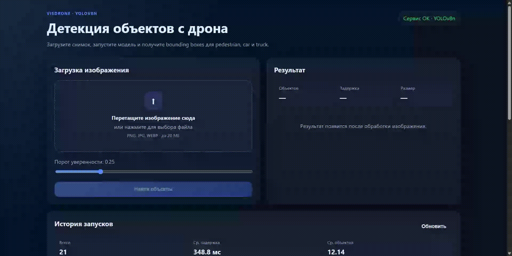

# Drone Object Detection Service

Сервис детекции объектов на снимках с дрона на базе обученной модели **YOLOv8n** (`weights/best.pt`).

Классы: `pedestrian`, `car`, `truck` (подмножество VisDrone-DET).

## Возможности

- REST API на FastAPI: `/health`, `/predict`, `/batch_predict`, `/stats`, `/history`
- Веб-интерфейс с drag-and-drop загрузкой изображения
- Сохранение истории запусков в SQLite
- Docker и docker-compose для воспроизводимого запуска
- Smoke-тесты

## Быстрый старт (локально)

```bash
cd plugins/Drone
pip install -r requirements.txt
uvicorn service.app.main:app --reload --host 0.0.0.0 --port 8000
```

Откройте в браузере: [http://localhost:8000](http://localhost:8000)

## Запуск через Docker

```bash
cd plugins/Drone
docker compose up --build
```

## API

### `GET /health`
Проверка готовности сервиса и загруженной модели.

### `POST /predict`
Принимает изображение (`multipart/form-data`, поле `file`).

Параметры:
- `confidence` — порог уверенности (по умолчанию `0.25`)

### `POST /batch_predict`
Пакетная обработка до 10 изображений.

### `GET /stats`
Сводная статистика: число запусков, средняя задержка, среднее число объектов.

### `GET /history`
История последних запусков.

## Структура проекта

```
plugins/Drone/
├── configs/inference.yaml
├── models/model_info.yaml
├── weights/best.pt
├── service/app/
│   ├── main.py
│   ├── detector.py
│   ├── database.py
│   └── static/
├── tests/
├── Dockerfile
├── docker-compose.yml
└── requirements.txt
```

## Тесты

```bash
cd plugins/Drone
pytest tests/test_smoke.py -q
```

## Примечания

- Веса модели должны находиться в `weights/best.pt`
- Результаты и история сохраняются в `data/`
- Для GPU укажите `device: "cuda"` в `configs/inference.yaml`

## Демонстрация проекта
